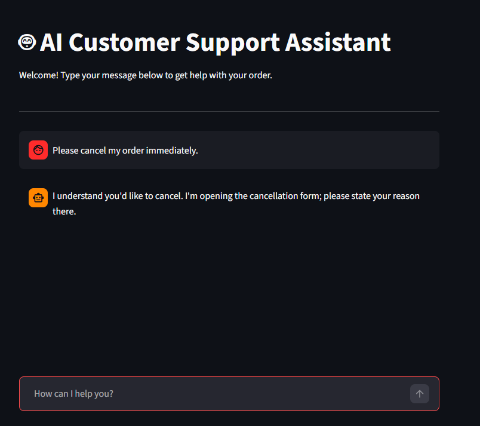

# 🤖 AI Customer Support Intelligence


## 🔗 Live Demo
Experience the AI Assistant in real-time: [Click here to launch the App](https://ai-customer-support-intelligence-rtpbm2lqccg3fbkto2azul.streamlit.app/)

A deep learning-powered customer support chatbot built with **TensorFlow** and **Streamlit**. This assistant can classify 27 different customer intents and provide appropriate automated responses.

🧪 How to Test the Assistant
The AI is specialized in specific customer service categories. To get the best results and see the model in action, try these phrases:

Shipping & Tracking: * "Where is my order?" (Correctly identified in your test! ✅)

"I want to track my package."

Address Changes: * "I need to change my shipping address."

"Change my delivery location."

Refunds & Returns: * "I want a refund for my last purchase."

"How can I return an item?"

Account Issues: * "I forgot my password."

"I'm having trouble logging in."

Payments:

"My credit card was declined."

"Where can I download my invoice?"

Note: If you get a generic response like "I'm looking into it right now", it means the intent was broad. Try to be more specific about your order or account!

## 🚀 Features
- **Intent Classification:** Uses a Neural Network to identify user needs.
- **Natural Language Processing:** Powered by TF-IDF Vectorization.
- **Real-time Chat UI:** Interactive interface built with Streamlit.
- **Automated Responses:** Smart mapping from intent to professional support messages.

## 📂 Project Structure
- `app.py`: The Streamlit web application.
- `customer.py`: Training script for the Neural Network.
- `models/`: Saved model, TF-IDF vectorizer, and label encoder.
- `data/`: Dataset files for training and validation.

## 🛠️ Installation & Usage

1. **Clone the repository:**
   ```bash
   git clone [https://github.com/yourusername/AI-Customer-Support-Intelligence.git](https://github.com/yourusername/AI-Customer-Support-Intelligence.git)
   cd AI-Customer-Support-Intelligence

2. **Install dependencies:**
   ```bash
   pip install -r requirements.txt

3.Run the application:

Bash
streamlit run app.py

🧠 Model Details
The model is a Sequential Neural Network with:

Input Layer: TF-IDF Features (Max 2000)

Hidden Layers: 512 & 256 neurons with ReLU activation.

Output Layer: 27 neurons with Softmax activation for multi-class classification.
